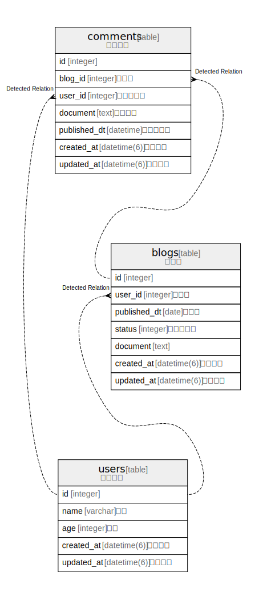

# development.sqlite3

## Tables

| Name | Columns | Comment | Type |
| ---- | ------- | ------- | ---- |
| [users](users.md) | 5 | ユーザー | table |
| [blogs](blogs.md) | 7 | ブログ | table |
| [comments](comments.md) | 7 | コメント | table |

## Relations

---

> Generated by [tbls](https://github.com/k1LoW/tbls)
