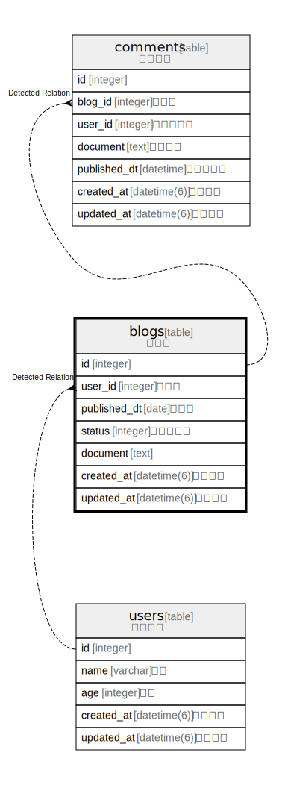

# blogs

## Description

ブログ

<details>
<summary><strong>Table Definition</strong></summary>

```sql
CREATE TABLE "blogs" ("id" integer PRIMARY KEY AUTOINCREMENT NOT NULL, "user_id" integer NOT NULL, "published_dt" date, "status" integer NOT NULL, "document" text NOT NULL, "created_at" datetime(6) NOT NULL, "updated_at" datetime(6) NOT NULL)
```

</details>

## Labels

`document`

## Columns

| Name | Type | Default | Nullable | Children | Parents | Comment |
| ---- | ---- | ------- | -------- | -------- | ------- | ------- |
| id | integer |  | false | [comments](comments.md) |  |  |
| user_id | integer |  | false |  | [users](users.md) | 作成者 |
| published_dt | date |  | true |  |  | 発行日 |
| status | integer |  | false |  |  | ステータス |
| document | text |  | false |  |  |  |
| created_at | datetime(6) |  | false |  |  | 作成日時 |
| updated_at | datetime(6) |  | false |  |  | 更新日時 |

## Constraints

| Name | Type | Definition |
| ---- | ---- | ---------- |
| id | PRIMARY KEY | PRIMARY KEY (id) |

## Indexes

| Name | Definition |
| ---- | ---------- |
| index_blogs_on_user_id | CREATE INDEX "index_blogs_on_user_id" ON "blogs" ("user_id") |

## Relations



---

> Generated by [tbls](https://github.com/k1LoW/tbls)
