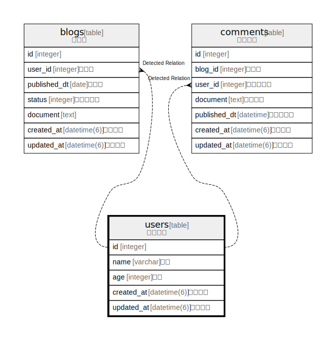

# users

## Description

ユーザー

<details>
<summary><strong>Table Definition</strong></summary>

```sql
CREATE TABLE "users" ("id" integer PRIMARY KEY AUTOINCREMENT NOT NULL, "name" varchar NOT NULL, "age" integer NOT NULL, "created_at" datetime(6) NOT NULL, "updated_at" datetime(6) NOT NULL)
```

</details>

## Labels

`private information`

## Columns

| Name | Type | Default | Nullable | Children | Parents | Comment |
| ---- | ---- | ------- | -------- | -------- | ------- | ------- |
| id | integer |  | false | [blogs](blogs.md) [comments](comments.md) |  |  |
| name | varchar |  | false |  |  | 氏名 |
| age | integer |  | false |  |  | 年齢 |
| created_at | datetime(6) |  | false |  |  | 作成日時 |
| updated_at | datetime(6) |  | false |  |  | 更新日時 |

## Constraints

| Name | Type | Definition |
| ---- | ---- | ---------- |
| id | PRIMARY KEY | PRIMARY KEY (id) |

## Relations



---

> Generated by [tbls](https://github.com/k1LoW/tbls)
